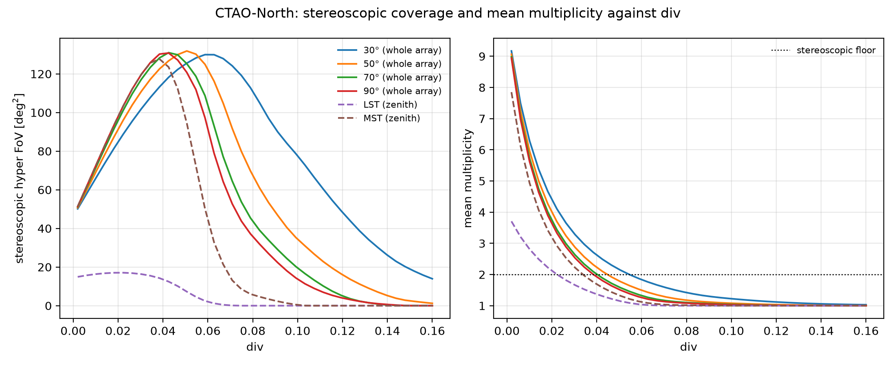
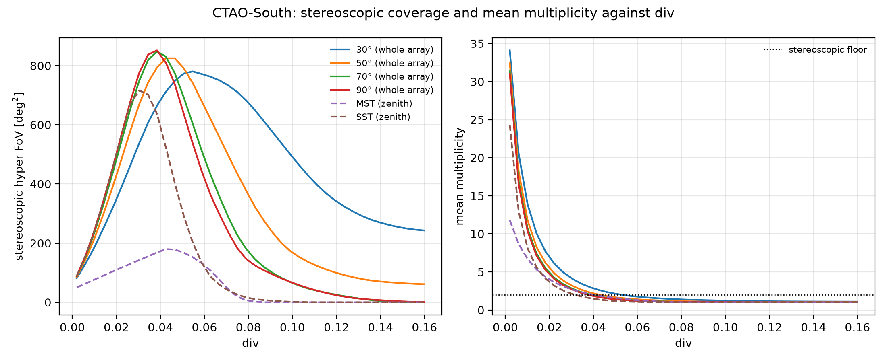
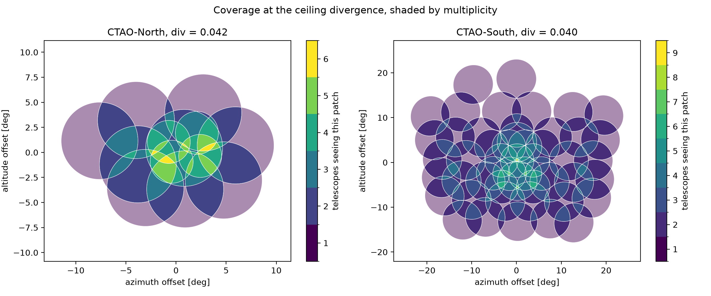

==================================
The divergence spread and ceiling
==================================

This page applies the quantities from :doc:`definitions`, the
stereoscopic hyper field of view :math:`A(2)` and the mean multiplicity,
to both CTAO sites: fine-grained curves against ``div``, then exactly
where they turn over, the **divergence ceiling**.

Definition
==========

Two numbers say how far an array can usefully be spread. The **parallel
reach** is the angular radius of the widest camera, what the array sees
pointed conventionally. The **ceiling divergence** is the ``div`` where
the mean multiplicity falls to two. Below it, spreading grows
:math:`A(2)`. Above it, the typical direction is seen by fewer than two
telescopes, so spreading trades stereoscopic sky for sky the array can't
reconstruct from. :math:`A(2)` peaks exactly at the ceiling and falls
back towards zero past it. Push further and both ``divtel`` and a real
array comply anyway, returning a configuration that records less, not
more.

Divergence conserves :math:`\Omega` (:doc:`definitions`). Rotating the
discs apart doesn't shrink them, so an array that puts exactly two
telescopes on every direction it covers would reach

.. math::

   A(2) = \Omega / 2

That bound is never hit. The multiplicity distribution at the ceiling
spreads around its mean of two rather than sitting on it: some covered
sky sits at multiplicity one and is wasted, some sits at three or more
and is deeper than stereoscopy needs. Both gaps eat into the bound. The
next two sections measure them for CTAO-North and CTAO-South.

CTAO-North: La Palma
=====================

Four LSTs sit inside nine MSTs. An LST camera has a field-of-view radius
of about 2.15°, an MST's about 3.84°, so the outer, more numerous
subarray also carries the wider camera.

Left, stereoscopic hyper FoV against ``div``, for the whole array at four
altitudes and for the two telescope types alone at the zenith. Right, the
corresponding mean multiplicity, with the stereoscopic floor of two
marked.

Each type saturates on its own schedule. The four LSTs, the narrower
camera, peak near ``div`` = 0.022 at 17 deg². The nine MSTs peak later,
near ``div`` = 0.038, at 128 deg². The whole-array curve is not their sum:
at low ``div`` it tracks the MSTs, then pulls ahead of them once the MSTs
stop overlapping each other and cross-type pairs take over.

Altitude moves the peak without moving its height by much. Between 30°
and 90° altitude the ``div`` that maximises coverage shifts from 0.043 to
0.059, while the coverage it buys stays within 1% of 132 deg². The
parameter has to be chosen for the pointing. What it delivers is close to
a property of the array.

CTAO-South: Paranal
=====================

Fourteen MSTs sit inside thirty-seven SSTs. The SST mirror is the
smaller of the two, but its shorter focal length gives it the wider
field of view: about 4.40° against 3.75° for the MST. Same shape as
La Palma: the outer, more numerous subarray carries the wider camera.
But the two cameras here are much closer in size.

Same rise-then-collapse shape as La Palma, just bigger and faster. The
SSTs, more numerous and wider-eyed, peak near ``div`` = 0.030 at
716 deg². The MSTs peak lower, near ``div`` = 0.043, at 180 deg². At low
``div`` the whole array tracks the SSTs almost exactly, since the MSTs'
narrower sky sits inside the SSTs' wider one, so folding them in adds
multiplicity rather than area. Push ``div`` further and cross-type pairs
start carrying coverage the SSTs alone have lost.

Across 30° to 90° altitude the ``div`` that maximises coverage shifts
from 0.038 to 0.055, while the coverage it buys stays within 8% of
851 deg². With fifty-one telescopes of two similarly sized cameras to
pair up, Paranal keeps mean multiplicity above the stereoscopic floor of
two well past the ``div`` where either subarray alone has given out.

Locating the ceiling
=====================

The table gives the parallel reach and the ceiling divergence for both
arrays, at 60° altitude, 180° azimuth.

.. list-table::
   :header-rows: 1

   * -
     - CTAO-North
     - CTAO-South
   * - Telescopes
     - 4 LST, 9 MST
     - 14 MST, 37 SST
   * - Parallel reach
     - 3.8°
     - 4.4°
   * - Parallel field of view :math:`A(1)`
     - 46 deg²
     - 61 deg²
   * - Parallel mean multiplicity
     - 10.3
     - 47.2
   * - Total camera solid angle :math:`\Omega`
     - 474 deg²
     - 2867 deg²
   * - Ceiling divergence
     - 0.042
     - 0.040
   * - Spread at the ceiling
     - 7.7°
     - 22.6°
   * - Stereoscopic footprint :math:`A(2)`
     - 129 deg²
     - 839 deg²
   * - Gain over parallel
     - 2.8×
     - 13.8×
   * - Fraction of the :math:`\Omega/2` bound
     - 54%
     - 59%
   * - Covered sky wasted at multiplicity 1
     - 46%
     - 41%
   * - Covered sky deeper than needed (:math:`\geq`\ 3)
     - 25%
     - 28%

*Spread is the largest angle between a telescope's pointing and the
array's mean pointing, at the ceiling. Camera radii come from the prod6
layout files.*

Two things the table and the maps show
---------------------------------------

**The two arrays are alike in reach and differ in depth.** CTAO-South is
four times larger on the ground with four times the telescopes, yet the
two parallel reaches sit within half a degree of each other and the two
ceiling divergences within 0.002. Both quantities depend on the ratio of
camera size to array scale, and that ratio happens to be similar at La
Palma and Paranal. What the ceiling buys differs by a much larger
factor, and the parallel mean multiplicity explains it: the gain
available over parallel pointing is half of it, so South, with roughly
four times North's parallel depth, converts that depth into a
correspondingly larger stereoscopic footprint. Divergence does not make
a large array reach further than a small one. It lets a deep array trade
depth it does not need for sky, and a shallow array has less to trade.

**Nearly half of what a divergent array watches is wasted.** Neither
array attains the :math:`\Omega/2` bound. The reason isn't the mean
multiplicity, it's its spread: mean multiplicity is two at the ceiling
in both cases, but a large share of the covered sky sits at multiplicity
one, seen by a single telescope and useless for stereoscopic
reconstruction, while a comparable share sits at three or more, deeper
than stereoscopy requires. The maps above draw that structure directly:
an over-covered core where several cameras pile up, ringed by a broad
band seen by exactly one telescope. A symmetric fan is shaped like the
array's ground footprint and has no way to move depth from where there
is too much of it to where there is none. Recovering that waste means
giving up the single global parameter and letting each telescope's
pointing follow the target instead of the ground.
