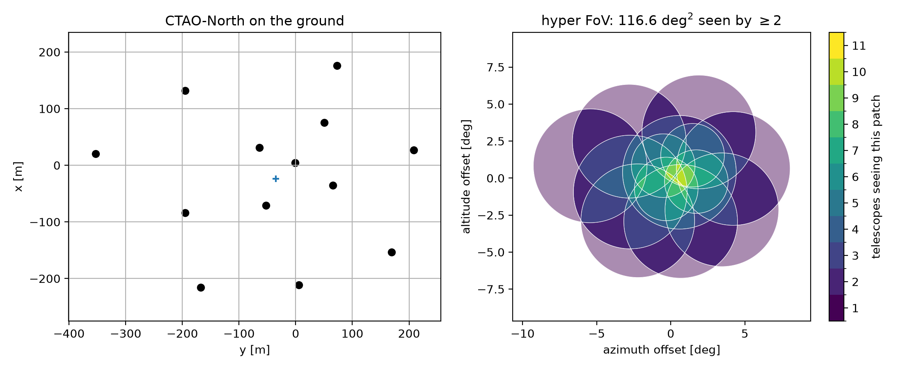
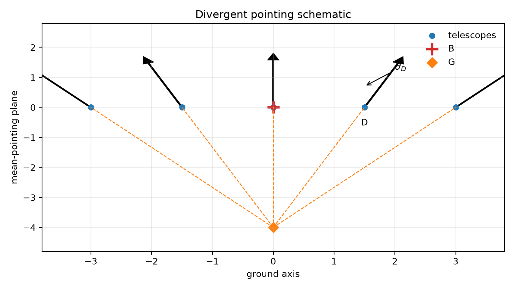

===========
Definitions
===========

``divtel`` works entirely in geometry and solid angle. It contains no
shower physics, no effective area, no night-sky background and no energy
threshold — see :doc:`capabilities` for where that stops and a shower
simulation has to take over. This page sets out the quantities it
computes, since the rest of this section is written in them. For the
package's actual interface, see the :doc:`guide`.

Pointing
========

A telescope is a ground position, a focal length :math:`f` and a camera
radius :math:`r`. The two camera numbers enter only through their ratio: a
camera of radius :math:`r` at the focus subtends a disc of angular radius
:math:`\rho = \arctan(r/f)` on the sky. Arrays are read from files giving
these per telescope, and the official CTAO prod6 Alpha layouts ship with
the package, so every number in this section can be reproduced without
assembling an array by hand.

Each telescope carries its own direction, and any telescope can be aimed
anywhere in the sky. Four ways of setting the directions cover everything
used here:

* **Parallel** — every telescope aimed at one sky position, conventional
  pointing.
* **Divergent** — every telescope spread by a single parameter, ``div``
  (`How divergent pointing is built`_ shows the construction).
* **Sub-arrays** — telescopes grouped, each group pointed independently.
  Not covered in this section yet.
* **Per-telescope** — a direction given for each telescope from a table,
  which turns the package from a divergence calculator into a general
  planning tool. Not covered in this section yet.

A telescope can also be aimed at a named object or a sky coordinate rather
than an alt-azimuth direction: :doc:`capabilities` covers tracking a real
source across a night.

What the array sees
====================

Each telescope sees a disc of angular radius :math:`\rho` centred on its
pointing. Pointed in parallel these discs coincide and the array sees one
disc. Pointed apart, the discs separate and their boundaries cut the union
into patches, every point of which is seen by the same number of
telescopes. That number is the **multiplicity** :math:`m`, and the field
:math:`m(\hat{n})` over the sky is the primary output of the package. From
it,

.. math::

   A(m_{\min}) = \sum_{i \,:\, m_i \ge m_{\min}} A_i

is the **hyper field of view**: the total solid angle seen by at least
:math:`m_{\min}` telescopes. :math:`A(1)` is the sky the array watches.
:math:`A(2)` is the sky it can *use*, because a shower recorded by a
single telescope yields no stereoscopic direction or impact point. Sky
seen once is not sky observed, so quoting :math:`A(1)` for a divergent
array overstates what it delivers — every coverage figure in this
documentation is :math:`A(2)` unless stated otherwise.

The second summary is the area-weighted mean multiplicity. Each camera
contributes its own solid angle to every patch it covers, so

.. math::

   \langle m \rangle = \frac{\sum_i m_i A_i}{\sum_i A_i} = \frac{\Omega}{A(1)},
   \qquad \Omega = \sum_{\mathrm{telescopes}} \pi \rho^2,

with :math:`\Omega` the array's total camera solid angle. This equation is
a conservation law: no pointing arrangement creates camera area, it only
redistributes a fixed :math:`\Omega` over whatever sky the array chooses to
watch, and :math:`\langle m \rangle` falls as that sky grows. Every
trade-off in :doc:`ceiling` follows from it. The variance of :math:`m`
over the same patches measures how *evenly* the coverage is spread, and it
is not a detail — see :doc:`ceiling` for why.

Both quantities are computed on a Lambert azimuthal equal-area projection
centred on the array's mean pointing, so patch areas are true solid angles
and there is no coordinate singularity at the zenith. `The array and the
sky it sees`_ below shows the two views the package draws from this: the
array on the ground with its pointing directions, and the sky it covers
shaded by multiplicity.

The array and the sky it sees
==============================

CTAO-North at ``div`` = 0.03, 70° altitude: four LSTs inside nine MSTs, each
with its own camera size.

Left, the array on the ground, with each telescope's pointing direction as
an arrow and the two camera sizes distinguished. Right, the sky the array
covers, shaded by multiplicity. The array watches :math:`A(1) = 178` deg²,
of which :math:`A(2) = 117` deg² is stereoscopic, at a mean multiplicity of
2.66. The outer ring seen by a single telescope is already visible at this
modest ``div`` — :doc:`ceiling` is about how far it can be pushed before
that ring is most of what is left.

How divergent pointing is built
================================

Divergent pointing aims every telescope along the line joining it to a
point :math:`G` placed behind the array, so telescopes on opposite sides
tilt in opposite directions and the array fans out like an umbrella.
:math:`G` sits on the mean pointing direction, a distance :math:`|BG|`
behind the barycentre :math:`B`, set by one dimensionless parameter
``div``:

.. math::

   |BG| = \frac{D}{\tan(\arcsin(\mathrm{div}))}, \qquad D = 100\,\mathrm{m},

equivalent to :math:`\mathrm{div} = \sin\theta_D`, with :math:`\theta_D`
the divergence acquired by a telescope at perpendicular offset :math:`D`
from the barycentre. At ``div`` = 0, :math:`G` recedes to infinity and the
array points in parallel; at ``div`` = 1 it sits at the barycentre and the
telescopes point radially outward.

Telescopes sit on the ground line through the barycentre :math:`B`; each
aims along the line from its own position through the aim point :math:`G`.
A telescope at perpendicular offset :math:`D` from :math:`B` acquires
divergence :math:`\theta_D`. Moving :math:`G` closer to :math:`B` steepens
every angle at once; moving it to infinity brings every telescope back to
parallel. This is a schematic in the plane containing the array and the
mean pointing direction, at an exaggerated ``div`` = 0.12 for clarity; a
real array spreads in three dimensions and :meth:`~divtel.telescope.Array.divergent_pointing`
handles that directly.
