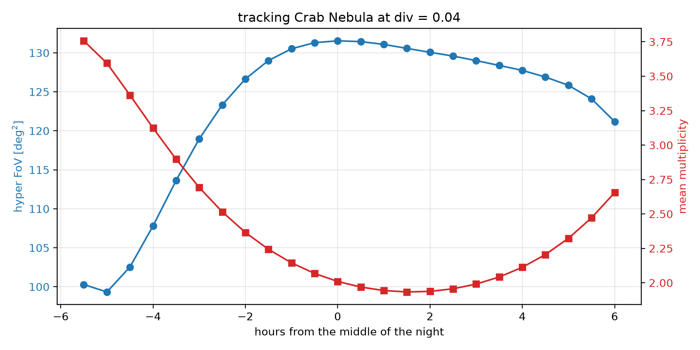

:hide-toc:

=================
Tracking a source
=================

Everything in :doc:`definitions` works in the ground frame: an array
pointed at alt 70°, az 180° stays pointed there whatever the hour. Real
sources rise and set, so :class:`~divtel.observation.Observation` ties the
ground frame to a site and a time and converts a sky position into the
alt/az pair :meth:`~divtel.telescope.Array.divergent_pointing` takes. A
configuration chosen once therefore does not stay the configuration in
force all night:

CTAO-North tracking the Crab Nebula at a fixed ``div`` = 0.04. Over eleven
hours the stereoscopic footprint moves between 100 and 132 deg², and the
mean multiplicity crosses the stereoscopic floor of two twice, once on
either side of transit — because the same altitude is reached rising and
setting. A configuration picked at the start of the night is not the
configuration a fixed ``div`` gives at the end of it; matching one to the
other means re-pointing during the night, not choosing ``div`` once.

Try it yourself
================

The plot above is one fixed ``div``, read off at a handful of hours. The
notebook behind it lets you change any of that: pick a different source,
site or night, drag ``div``, and step through the night hour by hour to
see the sky map update. It opens on the same array and source as the plot
above — CTAO-North, the Crab Nebula, ``div`` = 0.04 — on a night chosen so
the source stays up for the whole window, so the first thing it shows is
that same trade-off, before you touch anything.

.. raw:: html

    

      <iframe src="marimo/observing_a_source/index.html"
              title="Observing a real source, interactive demo"
              loading="lazy"></iframe>
      

        <a href="marimo/observing_a_source/index.html" target="_blank" rel="noopener">Open the
        demo in its own tab</a> for the full-screen version.
      

    

This runs on a Python interpreter compiled to WebAssembly: nothing is
installed, no code leaves your machine. It is built from
``examples/marimo/observing_a_source.py``; run or edit it locally with
``marimo edit examples/marimo/observing_a_source.py``.

